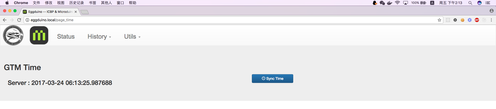
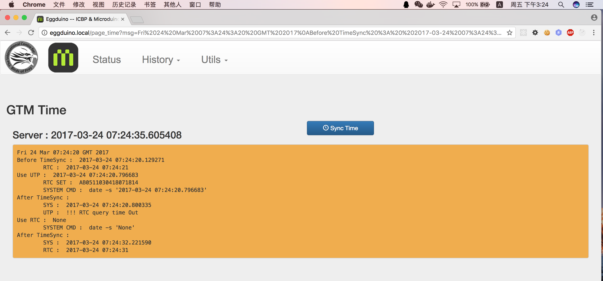
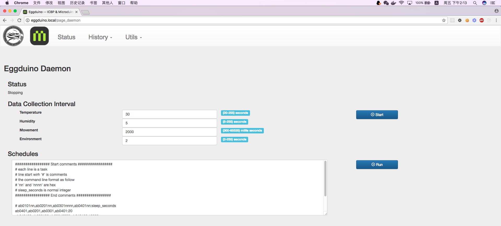
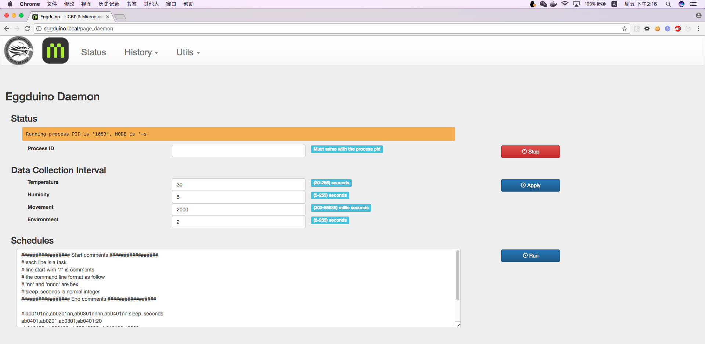
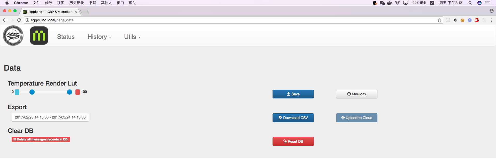
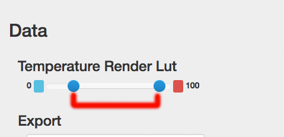

# mAcron for Eggduino
 
(Version 4， 201703204)
 
This software is a part of Eggduino, a project of [ICBP (International Centre for Birds of Prey)](http://www.icbp.org/index/), supported by microduino and their friends.

Support eggduino hardware firmware version : **VultureEgg_0.2.C14.00.hex**. Related project is [https://github.com/lixianyu/VultureEgg141](https://github.com/lixianyu/VultureEgg141)

## License 

Author : Hao CHEN
Email : iascchen (at) gmail.com

You can modify and distribute these code freely for education and scientific research, under the license of [Apache License 2.0](LICENSE) 

## Software Architecture

                       |
                      BLE
         Smart Egg ----|--->  mAcron Daemon --------> SQLite --------> mAcron Web App
                       |     (Recieve datas)                           (Visualization)
                       |
    Eggduino Hardware  |                 Eggduino Station 
                       |

## Connect to mAcron

mAcron version 4 is running on Raspberry Pi 3

OS : RASPBIAN JESSIE LITE, Version:March 2017, Release date:2017-03-02, Kernel version:4.4

[Refernce link](https://www.raspberrypi.org/downloads/raspbian/)

### Connect with Ethernet

You will use Putty(Win) or Term2(Mac) 

#### Ethernet(Must)

The network structure show as follow:

                        BLE                       Ethernet            Wifi／Ethernet
    Eggduino Hardware  ----->  Eggduino Station  --------->  Router  <--------------  Your computer
    
Connect the raspberry pi 3 to the same router with your computer. Use name `eggduino.local` to access it. 

### Connect with SSH(Must)

Username is `root`, and password is `eggduino`

	#### Connect with SSH from your Computer

	$ ssh root@eggduino.local
	root@eggduino.local's password: eggduino
	
	The programs included with the Debian GNU/Linux system are free software;
	the exact distribution terms for each program are described in the
	individual files in /usr/share/doc/*/copyright.
	
	Debian GNU/Linux comes with ABSOLUTELY NO WARRANTY, to the extent
	permitted by applicable law.
	Last login: Mon Mar 20 10:17:50 2017 from fe80::1cf7:ee6:4c83:8254%wlan0
	root@eggduino:~#

### Setting Wireless Connection(Optional)

The network structure show as follow:

                        BLE                       Wifi           Wifi
    Eggduino Hardware  ----->  Eggduino Station  -----> Router  <-----  Your computer

Here recorded the steps of wifi configuration, you can change the setting according to your wireless network. [Reference Link](https://www.raspberrypi.org/documentation/configuration/wireless/wireless-cli.md)

Before: 

	root@eggduino:~# ifconfig wlan0
	wlan0     Link encap:Ethernet  HWaddr e8:4e:06:2b:87:55
	          inet6 addr: fe80::2ee1:a471:e456:5975/64 Scope:Link
	          UP BROADCAST MULTICAST  MTU:1500  Metric:1
	          RX packets:0 errors:0 dropped:50 overruns:0 frame:0
	          TX packets:0 errors:0 dropped:0 overruns:0 carrier:0
	          collisions:0 txqueuelen:1000
	          RX bytes:0 (0.0 B)  TX bytes:0 (0.0 B)

	root@eggduino:~# iwlist wlan0 scan
	root@eggduino:~# wpa_passphrase %wifissidname% %wifipassword% >> /etc/wpa_supplicant/wpa_supplicant.conf
	
for example：
	
	wpa_passphrase Microduino_SS MakerModule2016 >> /etc/wpa_supplicant/wpa_supplicant.conf

Make sure the wireless setting is saved：

	root@eggduino:~# vi /etc/wpa_supplicant/wpa_supplicant.conf

Enable 

	root@eggduino:~# wpa_cli reconfigure
	Selected interface 'wlan0'
	OK

	root@eggduino:~# ifconfig wlan0
	wlan0     Link encap:Ethernet  HWaddr e8:4e:06:2b:87:55
	          inet addr:192.168.9.213  Bcast:192.168.9.255  Mask:255.255.255.0
	          inet6 addr: fe80::dc1a:e088:5aec:bea1/64 Scope:Link
	          UP BROADCAST RUNNING MULTICAST  MTU:1500  Metric:1
	          RX packets:181 errors:0 dropped:100 overruns:0 frame:0
	          TX packets:145 errors:0 dropped:1 overruns:0 carrier:0
	          collisions:0 txqueuelen:1000
	          RX bytes:34561 (33.7 KiB)  TX bytes:22900 (22.3 KiB)

	root@eggduino:~# 

You can use `wpa_cli status` the check the wireless setting, and got the ip address of eggduino station.

    root@eggduino:~# wpa_cli status
    
## Run mAcron for Eggduino 

    root@eggduino:~# cd workshops/eggduino-station
    root@eggduino:~/workshops/eggduino-station# ls
    README.md  config.py   db      manage.py          tests
    app        daemon  requirenments.txt  start_server.sh
    
	root@eggduino:~/workshops/eggduino-station# python manage.py runserver
    
### Directory Structure

    |- app          ----->   Source code of web server
    |- db           ----->   database.db stored the all data, it is a SQLite file  
    |- daemon       ----->   The daemon to recieve data from eggduino and store them to SQLite
    |- docs         ----->   Markdown file and imgs used on README
    |- tests        ----->   Some test code
    config.py       ----->   config the SQLite Database stored on 'db/database.db'
    start_server.sh ----->   Script to run web server on BACKEND
    README.md       ----->   Please read this file firstly

If you want to get the whole data, you should copy the file under folder 'db', and process it as SQLite DB file.
There are some tools can open SQLite DB file, such as 'DB browser of SQLite' of MAC.
    
### Run Web Server

You can start the server by `python manage.py runserver`, you can access the server with http://ip_address

    root@eggduino:~/workshops/eggduino-station# python manage.py runserver
    /usr/lib/python2.7/site-packages/flask/exthook.py:71: ExtDeprecationWarning: Importing flask.ext.script is deprecated, use flask_script instead.
      .format(x=modname), ExtDeprecationWarning
     * Running on http://0.0.0.0:5000/ (Press CTRL+C to quit)
     * Restarting with stat
    /usr/lib/python2.7/site-packages/flask/exthook.py:71: ExtDeprecationWarning: Importing flask.ext.script is deprecated, use flask_script instead.
      .format(x=modname), ExtDeprecationWarning
     * Debugger is active!
     * Debugger pin code: 277-916-687

Disable Debug mode, change the `use_debugger=True` to `use_debugger=False`

    root@eggduino:~/workshops/eggduino-station# vi manage.py
    
    ...
    manager.add_command("runserver", Server(host='0.0.0.0', port=80, use_debugger=False))
    ...

Run Web Server as backend. You can use the shell `./start_server.sh`

    root@eggduino:~/workshops/eggduino-station# nohup python manage.py runserver &
    
    root@eggduino:~/workshops/eggduino-station# tail -f nohup.out
    
Stop backend running Server

    root@eggduino:~/workshops/eggduino-station# ps -ef | grep python
      501 67739     1   0  2:40PM ttys002    0:00.22 python manage.py runserver
      501 67780 63076   0  2:42PM ttys002    0:00.00 grep python
    root@eggduino:/media/sdcard/mAcron-egg# kill -9 67739

    
### Data visualization

`/Status` show the latest data send from egg and station.

**Attention** The history time range is limited in less than 3 days.

`/History/Temperatures` show the temperatures of egg in latest one hour.

`/History/Quaternions` show the quaternions of egg in latest one hour.

`/History/Humidity` show the humidity of egg in latest one hour.

`/History/Environment` show the data of station in latest one hour.

### System Setting

#### Set system time

From header `/Utils/Time`

Click `Sync Time` button to set eggduino mAcron

The Sync result will be displayed as follow. Timesync script will call 'europe.pool.ntp.org' to get time. If can't get the response from NTP, it will call RTC module and use RTC response to set system date. 

**!!! Attention** This page will be locked and till the NTP response return. Please wait for the response.

#### Run Daemon

You can data collect daemon from menu : `/Utils/Daemon`

There are two running modes of the daemon: '-c' and '-s'
    
##### -c/--cmds mode 

Start daemon with fixed data collection interval.

Click 'Start' button to run daemon with '-c' mode

##### -s/--schedules mode

Start daemon with a command series. 

Click 'Run' button to run daemon with '-s' mode

    ################# Start comments #################
    # each line is a task
    # line start wirh '#' is comments
    # the command line format as follow
    # 'nn' and 'nnnn' are hex
    # sleep_seconds is normal integer
    ################# End comments #################

    # ab0101nn,ab0201nn,ab0301nnnn,ab0401nn:sleep_seconds
    ab0401,ab0201,ab0301,ab0401:20
    ab040120,ab020120,ab03012000,ab040120:10000
    # ab040120,ab020120,ab03012000,ab040120:10000
    ab040130,ab020130,ab03013000,ab040130:50000

Stop notification

* ab0100 / AB0100 : Stop temperature notification of eggduino
* ab0200 / AB0200 : Stop humidity notification of eggduino
* ab0300 / AB0300 : Stop mpu6050 measurement of eggduino
* ab0400 / AB0400 : Stop station notification

Start notification with default interval

* ab0101 / AB0101 : Start temperature notification with default interval, 20s. its minimal value is 20s
* ab0201 / AB0201 : Start humidity notification with default interval, 70s. its minimal value is 5s
* ab0301 / AB0301 : Start mpu6050 and measurement period is the default interval, 2s. 
* ab0401 / AB0401 : Start station notification with default interval, 5s. its minimal value is 2s

Start notification with setting interval

* ab0101nn / AB0101nn : Start temperature notification with setting interval, for example : set interval as 20s should send ab010114. According the LM75 sensor is slow, only return 1 temperature per second, so if you send `ab010101`, the temperature return interval will be about 16s
* ab0201nn / AB0201nn : Start humidity notification with setting interval, for example : set interval as 5s should send ab020105
* ab0301nnnn / AB0301nnnn : Start quaternions notification with setting interval, the unit is **millis seconds**, for example : set interval as 2ms should send ab03010002. 
* ab0401nn / AB0401nn : Start station notification with setting interval, for example : set interval as 15s should send ab04010f

**nn** is the hex value of seconds. for example : if you want to set interval as `10` seconds, set **nn** as `0a`

**nnnn** is the hex value of **millis seconds**. for example : if you want to set interval as `10` millis seconds, set **nnnn** as `000a`

    // AB03010001 -- start, interval is 1ms;
    // AB03010064 -- start, interval is 100ms;
    // AB0301012C -- start, interval is 300ms;
    // AB03010384 -- start, interval is 900ms;
    // AB03010BB8 -- start, interval is 3000ms;
    // AB03011388 -- start, interval is 5000ms;
    // AB03012710 -- start, interval is 10000ms;

#### Data visualization and dump

You can data collect daemon from menu : `/Utils/Data`

##### Temperature visualization

* Choose the temperature Render Lut, and 'Save' it. the number range between twos blue points will map to color from blue to red.

* Click the button 'Min-Max', will fetch the min and max temperatures from Sqlite, and save as temperature Render Lut.

##### Data dump

Select a time range and download the records to CSV.

##### Clear DB

**Danger** Delete all records in SQLite DB. Only click the button after you are sure the result. 
